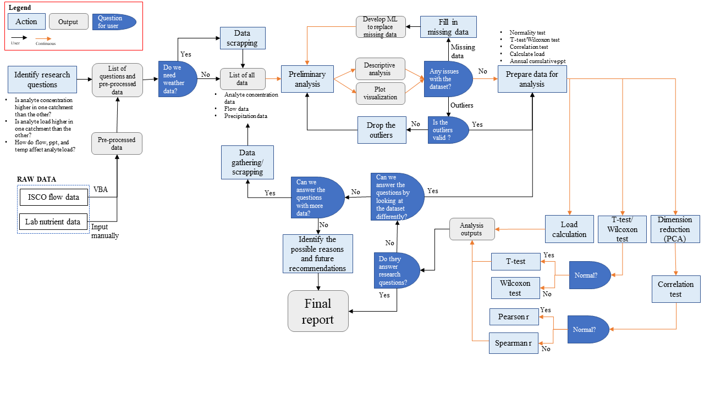
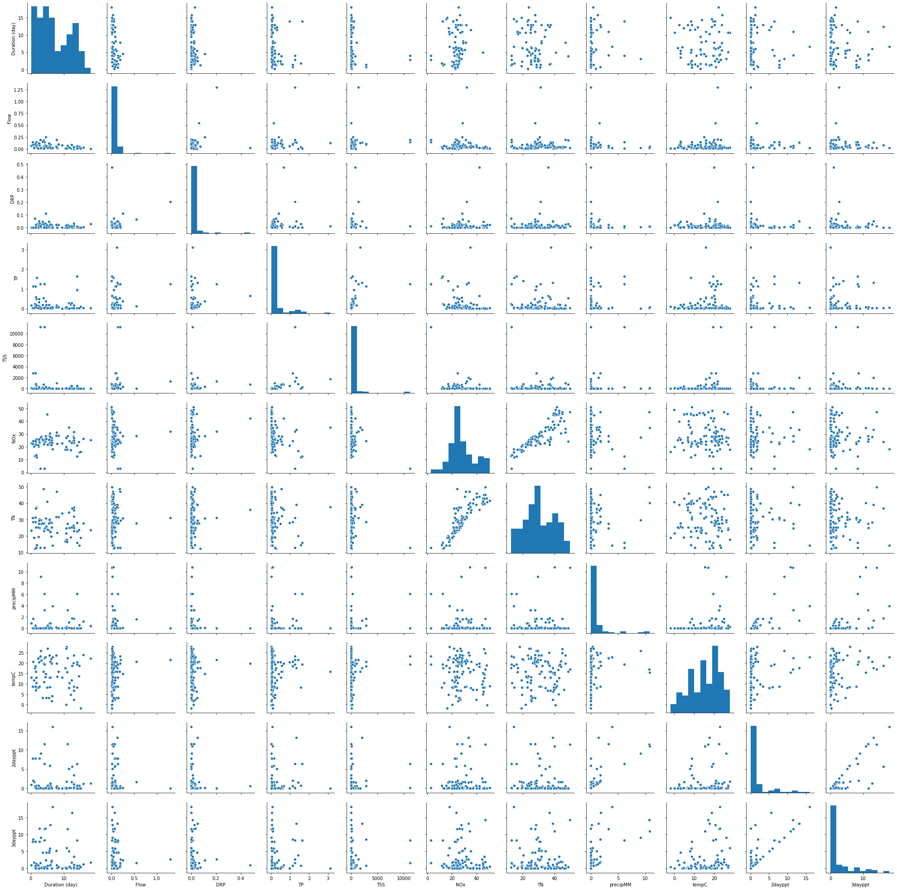
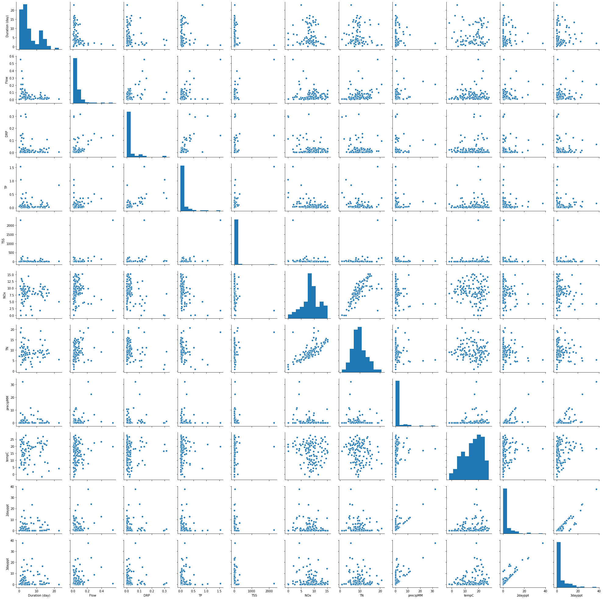

# Table of Content
<!--ts-->
* [Introduction](#introduction)  
  * [Problem statement](#problem-statement)  
* [Method and Approach](#method-and-approach)  
  * [Monitoring sites and sample collection](#monitoring-sites-and-sample-collection)  
  * [Sample and data analysis](#sample-and-data-analysis)  
  * [Project workflow and reproducibility](#project-workflow-and-reproducibility)  
* [Results and Discussion](#results-and-discussion)  
  * [Comparison of nutrient and sediment concentrations](#comparison-of-nutrient-and-sediment-concentrations)  
  * [Comparison of nutrient and sediment loads](#comparison-of-nutrient-and-sediment-loads)  
  * [Correlation between nutrient/sediment and environmental parameters](#correlation-between-nutrientsediment-and-environmental-parameters)  
* [Summary of Data Analysis](#summary-of-data-analysis)  
* [Supplemental Information](#supplemental-information)  
<!--te-->

# Introduction
As the leading state of corn, soybean, and hog production in the United States, Iowa also faces many water quality issues resulted from intensive agricultural activities, such as application of nitrogen and phosphorus fertilizers. Locally, nitrogen (N) loading into drinking water sources may result in higher water treatment costs, while phosphorus (P) loading may lead to eutrophication in freshwater systems (e.g. lake). At a larger scale, Iowa is estimated to account for 29% of the N loading into the Mississippi-Atchafalaya River Basin, which contributes to the formation of hypoxic zone in the Gulf of Mexico.  

Iowa Nutrient Reduction Strategy document has highlighted that a single best management practice (BMP) may not be sufficient to achieve the 45% N and P load reduction goal. However, several BMPs can combined in an agricultural field or catchment to improve the overall load reduction. This project was designed to compare the stacked benefits of BMPs at two adjacent agricultural catchments located in Black Hawk Lake watershed, Iowa.  

<kbd>
  
Fig 1: Aerial image of Black Hawk Lake (obtained from blackhawklake.org)
</kbd>  

#### Problem statement
This 5-year water quality monitoring project requires that we provide a semi-annual updates of our monitoring results. Traditionally, new monitoring data was added into the existing dataset (or modification to existing dataset) and the same analyses were performed manually every six months. This repetitve process consumed a huge amount of time, which then led to the the motivation to automate the process. The goal of this project was to develop a consistent workflow (i.e. reproducibility) to analyze the nutrient/sediment data and the associated parameters (i.e. flow, weather).  

The following program will allow any users with minimal python knowledge to analyze the datasets using a consistent method, in addition to saving time from analyzing each dataset manually every time a modification is made to the dataset.  

The questions to be answered using this program were:  
a) Is analyte concentration higher in one catchment than the other?  
b) Is analyte load higher in one catchment than the other?   
c) How does environmental factor (flow, precipitation, and temperature) affect analyte concentration and load?  

Additional data can be imported and additional analyses may be added in future development, as needed.

## Method and Approach
#### Monitoring sites and sample collection
Two adjacent catchments, namely catchment 11 and 12, were monitored between 2015 and 2018. Catchment 11 has lower areal extend of BMPs implementation than catchment 12. ISCO automated water samplers were installed to collect continuous flow measurement data and to collected flow-weighted samples at each catchment outlet. Catchment 11 only has one surface outlet, and the monitoring station was named as Surface 11 (S11). Catchment 12 has one surface outlet and one tile outlet, and were named as Surface 12 (S12) and Tile 12 (T12), respectively. The combined load from S12 and T12 represented the total loading from catchment 12.  

<kbd>
  
Fig 2: Black Hawk Lake watershed. The lake is located on the north end of the watershed; the monitored catchments (cathcment 11 and 12) are highlighted in green. Side note: "catchment" is labelled as "sub" in this image.
</kbd> 

#### Sample and data analysis  
The water samples were categorized into base flow samples and event (storm) flow samples. They were analyzed for NH3 (ammonia), NOx (nitrate+nitrite), TN (total nitrogen), DRP (dissolved reactive phosphorus), TP (total phosphorus), and TSS (total suspended solid) concentrations. Nutrient and sediment concentrations between two catchments were tested for significant differences. Normally distributed dataset was tested using t-test; non-normal dataset was tested using Wilcoxon Rank Sum test. In addition, correlations between nutrient/sediment concentration was tested for correlation with auxiliary parameter (flow, precip, temp). Normally distributed dataset was tested using pearsonr correlation; non-normal dataset was tested using spearmanr correlation test. Nutrient and sediment load at each catchment outlet was calculated by multiplying nutrient concentration and flow. Nutrient and sediment load between two catchments were also compared.  

#### Project workflow and reproducibility
This project workflow describes the analysis processes used in the [Python Notebook](https://github.com/jiyeow/jy_project/blob/master/ABE516x_finalproject.ipynb), which included both manual (black arrows) and automated (orange arrows) processes. Manual processes allowed users to visually inspect the data through scatter plots and data summary (i.e. mean, median, std dev) prior to the automated data analysis process.

In order for a user to reproduce the data analysis, the input data has to be organized into the preset template. The required inputs are "Site", "Sample date", "Sample interval", "Sample type", "Flow (cms)", "DRP (mg P/L)", "TP (mg P/L)", "TSS (mg/L)", "Nitrate (mg/L)", "TN (mg/L)". As the program is written to loop through a "list_of_analytes", the user may choose to add additional analytes (in concentration format) into the last column of the template worksheet. Note that the user will also need to add the analyte name into the "list_of_analyte" in the program. All data analysis can be performed by simply running the entire program. Several steps will prompt user to input text (e.g. site selection), if desired; if not desired, the user may choose to skip the step. All main figures will be exported as png files; intermediate (i.e. for visual inspection of dataset prior to data analysis) figures will not be exported.

The main advantage of this program is that a large portion of the data analysis/organization process is automated. For example, the data will be automatically organized into the desired data format prior to data analysis (correlation test, load calculation, t-test). However, the data analysis options are only limited to those that are currently included in this program. Although manual visual inspection will be performed, manual modifications to the program will be needed if the dataset requires an alternate data analysis/organization option. This could be a disadvantage for future users who are not familiar with Python. The other disadvantage (more like future development) is that this program did not incorporate machine learning (I tried a few models but none worked for this dataset due to high sample variability and relatively small sample size). Therefore, a missing data will not be automatically filled with the "prediced value".  

An example assignment with instructions from input to output can be found [here](https://github.com/jiyeow/jy_project/blob/master/Example_assignment.ipynb).

<kbd>
  
Fig 3: Project workflow
</kbd>

## Results and Discussion
#### Comparison of nutrient and sediment concentrations

Table 1: Median of analyte concentrations of base flow and event flow samples (2015-2018) at each catchment. The alphabet annotation represent the significant difference between base flow and event flow samples.  

|Catchment  | Sample Type   | DRP    | TP     | TSS    | NOx    | TN     |
| ---------:|--------------:| ------:| ------:| ------:| ------:| ------:|
|11         | Base          | 0.003 b| 0.035 b| 15.8 b | 26.9 a | 29.0 a |
|           | Event         | 0.014 a| 0.241 a| 148.0 a| 25.1 a | 28.7 a |
|12         | Base          | 0.007 a| 0.034 b| 7.2 b  | 8.8 a  | 9.1 a  |
|           | Event         | 0.016 a| 0.063 a| 18.6 a | 8.6 a  | 9.4 a  |

Highlights:
- The median concentrations of DRP, TP, and TSS were higher in the event samples than base flow at both catchments,
- The differences were significant, except for DRP at catchment 12,
- The median conecntrations of NOx and TN were similar in base and event flow samples at both catchments,
- The minor differences were not significant.  

Table 2: Median of analyte concentrations of base flow and event flow samples (2015-2018) at each catchment. The alphabet annotations represent the significant difference between catchments.  

|Sample Type | Catchment | DRP    | TP     | TSS    | NOx    | TN     |
| ---------- |:---------:| ------:| ------:| ------:| ------:| ------:|
|Base        | 11        | 0.003 b| 0.035 a| 15.8 a | 26.9 a | 29.0 a |
|            | 12        | 0.007 a| 0.034 a| 7.2 b  | 8.8 b  | 9.1 b  |
|Event       | 11        | 0.014 a| 0.241 a| 148.0 a| 25.1 a | 28.7 a |
|            | 12        | 0.016 a| 0.063 b| 18.6 b | 8.6 b  | 9.4 b  |

Highlights:
1) For baseflow samples
- DRP concentrations were significantly lower at catchment 11 than at catchment 12.
- TP concentrations were not significantly different at both catchments.
- TSS, NOx, and TN concentrations were significantly higher at catchment 11 than at catchment 12.
2) For event flow samples
- DRP concentrations were not significantly different at both catchments.
- TP, TSS, NOx, and TN concentrations were significantly higher at catchment 11 than at catchment 12.
 
#### Comparison of nutrient and sediment loads 
<kbd>
  
Fig 4: Annual DRP load at catchment 11 and 12. Side note: "catchment" is labelled as "sub" in this image.
</kbd>  
DRP loads were higher at catchment 11 than at catchment 12 during 2016 and 2017, but was lower during 2018.

<kbd>
  
Fig 5: Annual TP load at catchment 11 and 12. Side note: "catchment" is labelled as "sub" in this image.
</kbd>  
TP loads were consistently higher at catchment 11 than at catchment 12 between 2016 and 2018.

<kbd>
  
Fig 6: Annual TSS load at catchment 11 and 12. Side note: "catchment" is labelled as "sub" in this image.
</kbd>  
TSS loads were consistently higher at catchment 11 than at catchment 12 between 2016 and 2018.

<kbd>
  
Fig 7: Annual NOx load at catchment 11 and 12. Side note: "catchment" is labelled as "sub" in this image.
</kbd>  
NOx loads were consistently higher at catchment 11 than at catchment 12 between 2016 and 2018.

<kbd>
  
Fig 8: Annual TN load at catchment 11 and 12. Side note: "catchment" is labelled as "sub" in this image.
</kbd>  
TN loads were consistently higher at catchment 11 than at catchment 12 between 2016 and 2018.

#### Correlation between nutrient/sediment and environmental parameters
PCA analysis was used to as preliminary step to determine if these environmental parameters can explain the nutrient or sediment concentrations. Note that PCA analysis cannot distinguish individual relationship between nutrient/sediment concentration and environmental parameters. If PC1, PC2, and PC3 explained little variance of the nutrient/sediment data, then correlation test will not be conducted. If PC1, PC2, and PC2 explained majority of the nutrient/sediment concentration, then correlation test will be conducted to reveal individual relationship between nutrient/sediment and environmental parameters.

The tested environmental parameters were:
- 1-day precipitation
- 2-day precipitation
- 3-day precipitation
- Temperature
- Flow rate

There were 10 PCA outputs, and all showed similar trend. Therefore, only one example output is included here. For individual outputs, refer to [Python Notebook](https://github.com/jiyeow/jy_project/blob/master/ABE516x_finalproject.ipynb) Part 3C.

<kbd>
  
Fig 9: Example PCA output. DRP data from catchment 12 was used in this analysis. More than 90% of the variance was explained by the environmental parameters.
</kbd>

To prevent having massive outputs (2 catchments x 2 sample types x5 analytes x 5 environmental parameters =100) and the difficulty to read through the ouputs, only the correlation that were tested significant (p<0.05) was printed. The ouputs are summarized in the Tables 3 and 4.

Table 3: Correlation of nutrient/sediment concentration (separated by base and event flow samples) and environmental parameters at catchment 11. Non-significant correlations were left blank in the table.  

|Sample Type | Analyte (mg/L) | Flow (cms)| 1-day ppt(mm)| 2-day ppt(mm)| 3-day ppt(mm)| Temp (ºC)|
| ---------- |:--------------:| ---------:| ------------:| ------------:| ------------:| --------:|
|Base        | DRP            |           |              |              |              |          |
|            | TP             |           |              |              |              |          |
|            | TSS            |           |              |              |              |          |
|            | NOx            |           |              |              |              |          |
|            | TN             |           |              |              |              |          |
|Event       | DRP            | 0.486     |              |              |              |          |
|            | TP             | 0.409     |              |              |              | 0.383    |
|            | TSS            | 0.564     |              |              |              | 0.508    |
|            | NOx            |           |              | -0.45        |              |          |
|            | TN             |           |              |              |              |          |

Table 4: Correlation of nutrient/sediment concentration (separated by base and event flow samples) and environmental parameters at catchment 12. Non-significant correlations were left blank in the table.  

|Sample Type | Analyte (mg/L) | Flow (cms)| 1-day ppt(mm)| 2-day ppt(mm)| 3-day ppt(mm)| Temp (ºC)|
| ---------- |:--------------:| ---------:| ------------:| ------------:| ------------:| --------:|
|Base        | DRP            |           |              | -0.024       |              |          |
|            | TP             |           |              |              |              |          |
|            | TSS            |           |              |              |              | 0.228    |
|            | NOx            | 0.436     |              |              |              |          |
|            | TN             | 0.478     |              |              |              |          |
|Event       | DRP            | 0.626     |              |              |              |          |
|            | TP             | 0.616     |              |              |              |          |
|            | TSS            | 0.559     |              |              |              |          |
|            | NOx            |           | -0.434       |              |              | -0.319   |
|            | TN             |           |              |              |              | -0.383   |

Only consistent correlations were found between Flow and DRP, TP, and TSS concentrations for event samples.

## Summary of Data Analysis
Key note:
Catchment 11 has smaller aeral extent of BMPs implementation; catchment 12 has larger aereal extent of BMPs implementation.

a) Is analyte concentration higher in one catchment than the other?  
Yes, significant differences were found in some of the analytes at these two catchments. Higher TP, TSS, NOx, and TN concentrations were found in catchment 11. However, DRP concentration appeared to be higher in catchment 12.  

b) Is analyte load higher in one catchment than the other?   
TP, TSS, NOx, and TN loads were consistenly higher in the catchment 11 during all monitoring years. Meanwhile, DRP loads were higher in catchment 11 during 2016 and 2017, but became lower than catchment 12 during 2018.

c) How does environmental factor (flow, precipitation, and temperature) affect analyte concentration and load?  
Only flow rates showed consistent and significant correlations with DRP, TP, and TSS concentrations of event samples.

The results and discussions can be updated when new data (i.e. new monitoring year) is added. Year-to-year comparison is available for certain data analysis, such as load calculation, box plot, and descriptive summary. Correlation test and significant test are not available for year-to-year comparison (although overall comparison will be updated), but this option can be added in the future.
##

## Supplemental Information
Codes for all data analysis can be found [here](https://github.com/jiyeow/jy_project/blob/master/ABE516x_finalproject.ipynb)  
Codes for weather data scrapping can be found [here](https://github.com/jiyeow/jy_project/blob/master/Weather_scrapping.ipynb)  

Box plots of nutrient/sediment concentrations.  
<kbd>
  
Fig S1: DRP (mg/L) concentration at catchment 11 and 12 between 2015 and 2018.
</kbd>

<kbd>
  
Fig S2: TP (mg/L) concentration at catchment 11 and 12 between 2015 and 2018.
</kbd>

<kbd>
  
Fig S3: TSS (mg/L) concentration at catchment 11 and 12 between 2015 and 2018.
</kbd>

<kbd>
  
Fig S4: NOx (mg/L) concentration at catchment 11 and 12 between 2015 and 2018.
</kbd>

<kbd>
  
Fig S5: TN (mg/L) concentration at catchment 11 and 12 between 2015 and 2018.
</kbd>
 
Pairplot to visualize correlations  
<kbd>
  
Fig S6: Pairplot at catchment 11.
</kbd>

<kbd>
  
Fig S7: Pairplot at catchment 12.
</kbd>

